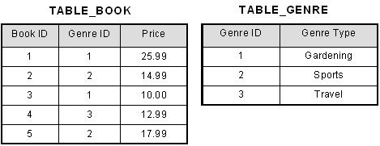

# NORMALIZATION IN DATABASE
## Introduction
Normalizatin is a technique used to organise data into databases. It is a systematic approach to remove the data redundancy and also improves data integrity.

It involves dividing a large table into smaller , more manageable pieces based on functional dependencies among attributes, ensuring that data anomallies are minimized.
Normalization is commonly used for two purpose   
- Remove data redundancy.
- Ensuring data dependencies of proper.

Without data normalization anomallies occur and it becomes difficult to handle and Update data . To understand these i'll take anexamplle using a table,
|ID    | Name    |Address   | Subject     |
|------|---------|----------|-------------|
| 201  | Akshay  |  Hamas   |  Biology    |
| 202  | Charu   |  Baha    |  Math       |
| 203  | Disha   |  Baziah  |  English    |
| 204  | Eva     |  Figi    |  French     |
- Apdation Anormally-To update address of a students who accur twice or more than twice you are required to **update** Address column in all the rows, else data will become inconsistent.
- Insertion Anormally-Suppose for a new admission, we have a Student id, name and address of a student but if student has not opted for any subject yet then we have to insertNULL there, leading to Insertion Anamoly.
- Deletion Anamoly – If id 401 has only one subject and temporarily he drops it, when we delete that row, entire student record will be deleted along with id.

## Normalization Form:
Normalization is mainly devided into 3 normal forms.
- First Normal Form 
- Second Normal Form
- Third normal Form
### First Normal Form 
in normal form normalization no two rows of data must contain repeating data i.e.,Whenever we search for a particular resulpt the multiple column connot be used to fetch the same row.

Table should be organised into rows, each row should have a primary key that distinguishes it as unique.

consider this a not a 1st normal form
|firstname  |  age   |   subject   |
|-----------|--------|-------------|
|Amos       | 19     | maths       |
|Alex       | 20     |maths&english|
|John       | 18     | english     |
|Moses      | 21     | french      |

now transformed to first normal form
|firstname  |  age   |   subject   |
|-----------|--------|-------------|
|Amos       | 19     | maths       |
|Alex       | 19     | maths       |
|Alex       | 20     | english     |
|John       | 18     | english     |
|Moses      | 21     | french      |

Using first normal form, data redundancy increases, as there will be many columns with the same data in multiple rows as a whole will be unique. 

### Second Normal Form
In second normal form there must be not any partial dependency of any column on primary key .it means tha for a table that concatenate primary key,each column in the table that is not part of the primary key must depend upon the entire concatenated key for its existence.
- Meet all requirements from first normal form
- Eliminate subsets of data that apply to multiple rows and place them in a seperate table
- create a relationship between new tables and their predecessors through the use of foreign keys.

### Third Normal Form
- Relation is **3NF** if it is in **2NF** and it contains no transitive dependencies.
- Even though tables in 2NF have reduced redundancy compared to 1NF, they may still encounter issues like update anomalies. For example, if one row is updated and another one is not, this can lead to inconsistent data. This happens due to transitive dependencies, which 3NF resolves by removing such dependencies, making the database more reliable.

example using a simplr table.

#### Why is 3NF Important?
- Eliminates Redundancy: 3NF helps to remove unnecessary duplication of data by ensuring that non-prime attributes (attributes not part of any candidate key) depend directly on the primary key, not on other non-prime attributes.

- Prevents Anomalies: A table in 3NF is free from common anomalies such as:

Insertion Anomaly: The inability to insert data without having to insert unwanted or redundant data.

Update Anomaly: The need to update multiple rows of data when a change occurs in one place.

Deletion Anomaly: The unintended loss of data when a record is deleted.

- Preserves Functional Dependencies: 3NF ensures that all functional dependencies are preserved, meaning that the relationships between attributes are maintained.

- Lossless Decomposition: When decomposing a relation to achieve 3NF, the decomposition should be lossless, meaning no information is lost in the process of normalization.

