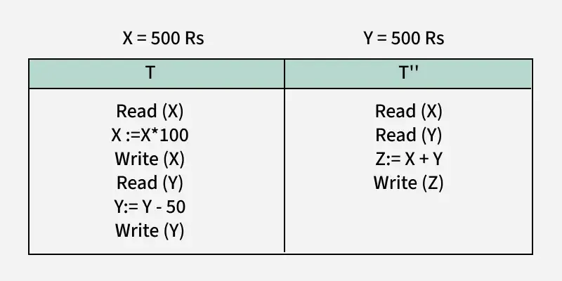

# ACID PROPERTIES IN DATABASE
Acid stands for 
- Atomicty
- Consistency
- Isolation 
- Durability

These four key properties define how a transaction should be processed in reliable and predictable manner, ensuring that the database remains consistent, even in cases of failure ar concurrent accesses.
 

## 1. Atomicity 
Atomicity ensures that a transaction is atomic, it means that either the entire transaction completes fully or doesn't execute at all. There is no in-between state i.e. transactions do not occur partially. If a transaction has multiple operations, and one of them fails, the whole transaction is rolled back, leaving the database unchanged. This avoids partial updates that can lead to inconsistency.

- **Commit**: If the transaction is successful, the changes are permanently applied.
- **Abort/Rollback**: If the transaction fails, any changes made during the transaction are discarded.

## 2. Consistency: Maintaining Valid Data States
Consistency ensures that a database remains in a valid state before and after a transaction.

 It guarantees that any transaction will take the database from one consistent state to another, maintaining the rules and constraints defined for the data. In simple terms, a transaction should only take the database from one valid state to another. 

If a transaction violates any database rules or constraints, it should be rejected, ensuring that only consistent data exists after the transaction.

Example:
-  Suppose the sum of all balances in a bank system should always be constant. Before a transfer, the total balance is $700. After the transaction, the total balance should remain $700. If the transaction fails in the middle (like updating one account but not the other), the system should maintain its consistency by rolling back the transaction

**total before T occur = 500 + 200 = 700**
total after T occurs = 400 + 300 = 700

## 3. Isolation : Ensuring Concurrent Transactions Don't Interfere
This property ensures that multiple transactions can occur concurrently without leading to the inconsistency of the database state. Transactions occur independently without interference.

 Changes occurring in a particular transaction will not be visible to any other transaction until that particular change in that transaction is written to memory or has been committed.

This property ensures that when multiple transactions run at the same time, the result will be the same as if they were run one after another in a specific order. 

This property prevents issues such as dirty reads (reading uncommitted data), non-repeatable reads (data changing between two reads in a transaction), and phantom reads (new rows appearing in a result set after the transaction starts).

**Example: i'll consider two transactions t and t''

- x=500, y = 500

|     t     |    t''    |
|-----------|-----------|
|Read(x)    |Read(x)    |
|x;=x*100   |Read(y)    |
|Write(x)   |z:=x+y     |
|Read(y)    |Write(z)   |
|y:y-50     |           |
|write(y)   |           |

#### Transaction T:
- T wants to transfer $50 from X to Y.
- T reads Y (value: 500), deducts $50 from X (new X = 450), and adds $50 to Y (new Y = 550).
#### Transaction T'':
- T'' starts and reads X (value: 500) and Y (value: 500), then calculates the sum: 500 + 500 = 1000.

But, by the time T finishes, X and Y have changed to 450 and 550 respectively, so the correct sum should be 450 + 550 = 1000. Isolation ensures that T'' should not see the old values of X and Y while T is still in progress. Both transactions should be independent, and T'' should only see the final state after T commits. This prevents inconsistent data like the incorrect sum calculated by T''

## 4. Durability: Persisting Changes
This property ensures that once the transaction has completed execution, the updates and modifications to the database are stored in and written to disk and they persist even if a system failure occurs. These updates now become permanent and are stored in non-volatile memory. In the event of a failure, the DBMS can recover the database to the state it was in after the last committed transaction, ensuring that no data is lost.

Example: After successfully transferring money from Account A to Account B, the changes are stored on disk. Even if there is a crash immediately after the commit, the transfer details will still be intact when the system recovers, ensuring durability.

##### How Acid Properties impact DB operations
- Data integrity and consistency
- Concurrency control
- Recovery and Fault Torerance
##### Disadvantages of Acid properties
- Performance Overhead.
- Complexity.
- Scalability Issues.
##### where acid can be applied
 - **Banking**-used in transactions involving money transfer, deposits and withdrawals , this must maintain strict consistency and durability to prevent errors and fraud.
 - **E-commerce** checks on inventories , order, and customer details are handled correctly and consistently,even during high traffic, requires ACID compliance.
 - **Healthcare** patient records, test results, and prescription must adhere to strict consistency,integrity, and security stardards.

